# 🎯 나만의 퀴즈 게임

## 개발 환경

- OS: Windows (Git Bash / MINGW64)
- Python: 3.14.6
- Git: 2.47.0.windows.2
- Editor: VS Code 1.130.0

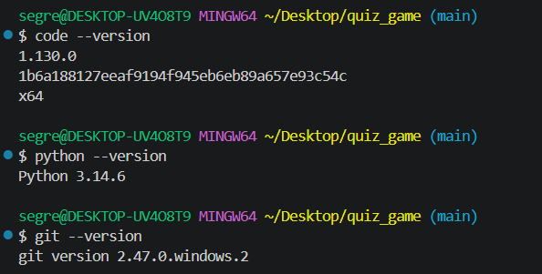

## 프로젝트 개요

Python 기본 문법과 객체지향(클래스), JSON을 이용한 데이터 저장을 학습하기 위해
터미널에서 동작하는 퀴즈 게임을 직접 구현한 프로젝트입니다.
사용자는 퀴즈를 풀고, 새로운 퀴즈를 추가/수정/삭제하고, 등록된 퀴즈 목록과
최고 점수를 확인할 수 있으며, 프로그램을 종료해도 데이터가 유지됩니다.
또한 Git을 이용해 기능 단위로 커밋을 남기고, 브랜치를 나눠 작업한 뒤 병합하며
개발 이력을 관리했습니다.

## 퀴즈 주제와 선정 이유

IT 및 비즈니스를 공부하는 학습자로서, 개발 기초 상식과 일반 상식을 함께
복습할 수 있는 퀴즈를 직접 만들어보고 싶어 이 주제를 선정했습니다.

## 실행 방법

```bash
python main.py
```

실행 후 메뉴에 나오는 번호(1~8)를 입력해 원하는 기능을 선택합니다.
대부분의 입력창에서 `b`를 입력하면 이전(메뉴)으로 돌아가고, `q`를 입력하면
지금까지의 변경사항을 저장하고 즉시 종료합니다. `?`를 입력하면 도움말이
표시됩니다.

## 기능 목록

| 메뉴 | 기능      | 설명                                                               |
| ---- | --------- | ------------------------------------------------------------------ |
| 1    | 퀴즈 풀기 | 원하는 문제 수만큼, 무작위 순서로 출제하고 채점 결과와 점수를 확인 |
| 2    | 퀴즈 추가 | 문제/선택지 4개/정답/힌트(선택) 입력, 빈 값 재입력 유도            |
| 3    | 퀴즈 목록 | 등록된 퀴즈 목록 확인                                              |
| 4    | 점수 확인 | 최고 점수와 총 플레이 횟수 확인 (안 풀었으면 안내)                 |
| 5    | 퀴즈 삭제 | 번호 선택 후 재확인(y/n)을 거쳐 삭제                               |
| 6    | 퀴즈 수정 | 항목별로 현재 값을 보여주고, Enter만 누르면 기존 값 유지           |
| 7    | 게임 기록 | 최근 5개 기록 표시 (전체 기록은 파일에 계속 보존)                  |
| 8    | 종료      | 저장 후 종료                                                       |

**공통으로 적용되는 부분**

| 항목            | 내용                                                              |
| --------------- | ----------------------------------------------------------------- |
| 입력 예외 처리  | 공백 제거, 숫자 변환 실패, 범위 밖, 빈 입력을 모두 안내 후 재입력 |
| 안전 종료       | Ctrl+C, EOFError 발생 시에도 저장 후 안전하게 종료                |
| 데이터 복구     | 파일이 없거나 손상된 경우 기본 퀴즈 5개로 자동 복구               |
| 전역 네비게이션 | 대부분의 입력창에서 `b`(이전 메뉴), `q`(저장 후 종료) 공통 동작   |
| 도움말          | 입력창에서 `?` 입력 시 네비게이션 안내 표시                       |
| 즉시 저장       | 메뉴 동작을 마칠 때마다 바로 `state.json`에 반영                  |
| 힌트 점수 차감  | 힌트 사용 시 미리 안내 후, 해당 문제는 0.5문제로 처리             |

## 클래스 구조

|             | Quiz                                                                    | QuizGame                                                                 |
| ----------- | ----------------------------------------------------------------------- | ------------------------------------------------------------------------ |
| 역할        | 문제 하나의 데이터와, 그 문제 자체에 대한 동작을 담당                   | 여러 Quiz를 모아 관리하며 게임 진행 전체를 담당                          |
| 주요 데이터 | 문제, 선택지 4개, 정답 번호, 힌트                                       | 퀴즈 목록, 최고 점수, 게임 기록                                          |
| 주요 동작   | 자기 자신을 화면에 출력, 입력된 답이 정답인지 채점, 힌트 보유 여부 확인 | 문제 출제·채점 진행, 퀴즈 추가·수정·삭제, 점수·기록 관리, 공통 입력 검증 |

문제 하나에 대한 정보와 동작은 Quiz에, 게임을 진행하는 흐름과 여러 문제를
관리하는 일은 QuizGame에 맡겨 역할을 분리했습니다. 이렇게 나누면 문제
자체의 형식을 바꾸고 싶을 때는 Quiz만, 게임 진행 방식을 바꾸고 싶을 때는
QuizGame만 살펴보면 되어 한쪽의 변경이 다른 쪽에 영향을 덜 미칩니다.

## 파일 구조

```
Codyssey2/
├── main.py            # 실행 진입점, 메뉴 루프, 예외(Ctrl+C/EOFError) 처리
├── quiz.py             # Quiz 클래스
├── quiz_game.py        # QuizGame 클래스, 공통 입력 검증
├── data_manager.py     # state.json 저장/불러오기, 손상 시 기본 데이터 복구
├── state.json           # 퀴즈 데이터, 최고 점수, 게임 기록 저장 파일
├── docs/
│   └── screenshots/     # 실행 화면, 개발 환경, Git 이력 캡처
├── .gitignore
└── README.md
```

## 데이터 파일 설명 (state.json)

- 경로: 프로젝트 루트의 `state.json`
- 인코딩: UTF-8
- 파일이 없거나 손상된 경우, 프로그램이 자동으로 기본 퀴즈 5개로 복구합니다.

**필드 구성**

| 필드                        | 자료형             | 설명                                      |
| --------------------------- | ------------------ | ----------------------------------------- |
| `quizzes`                   | 리스트             | 등록된 퀴즈들의 목록                      |
| `quizzes[].question`        | 문자열             | 문제 내용                                 |
| `quizzes[].choices`         | 리스트             | 선택지 4개                                |
| `quizzes[].answer`          | 정수               | 정답 번호(1~4)                            |
| `quizzes[].hint`            | 문자열 또는 `null` | 힌트 (없으면 `null`)                      |
| `best_score`                | 정수 또는 `null`   | 최고 점수 (아직 안 풀었으면 `null`)       |
| `history`                   | 리스트             | 게임을 할 때마다 쌓이는 기록              |
| `history[].datetime`        | 문자열             | 플레이한 날짜/시간                        |
| `history[].total_questions` | 정수               | 그 판에서 푼 문제 수                      |
| `history[].correct_count`   | 숫자               | 맞힌 문제 수 (힌트 사용 시 0.5 단위 포함) |
| `history[].score`           | 정수               | 그 판의 점수                              |

**전체 구조 예시**

```json
{
    "quizzes": [
        {
            "question": "Python의 창시자는?",
            "choices": ["Guido van Rossum", "Linus Torvalds", "Bjarne Stroustrup", "James Gosling"],
            "answer": 1,
            "hint": "네덜란드 출신 프로그래머입니다."
        }
    ],
    "best_score": 100,
    "history": [
        {
            "datetime": "2026-07-29 21:30:00",
            "total_questions": 3,
            "correct_count": 3,
            "score": 100
        }
    ]
}
```

가장 바깥은 `quizzes`, `best_score`, `history`라는 세 개의 필드를 가진
하나의 딕셔너리입니다. 이 중 `quizzes`와 `history`의 값은 각각 리스트이고,
그 리스트 안에는 퀴즈 한 개, 기록 한 건을 나타내는 딕셔너리가 다시
들어있는 중첩 구조입니다. 여러 개를 순서대로 담아야 하는 데이터(퀴즈
목록, 게임 기록)는 리스트로, 이름으로 구분되는 값들의 묶음(문제 하나,
기록 한 건)은 딕셔너리로 표현한 결과입니다.

## 실행 화면

### 메뉴

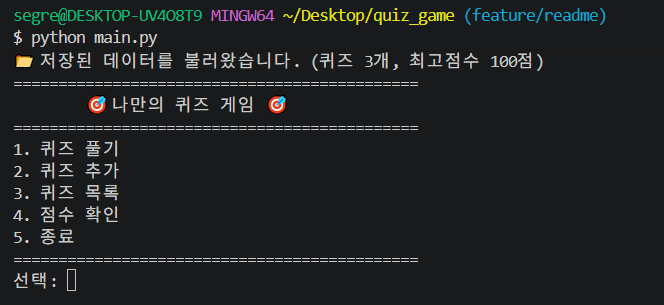

### 퀴즈 풀기 (랜덤 출제 · 문제 수 선택 · 힌트 h키)

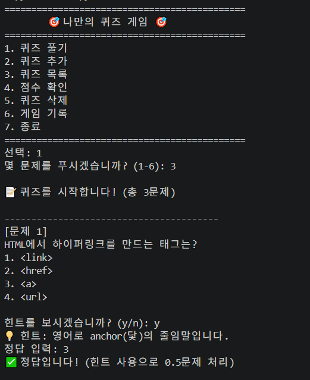

### 퀴즈 추가 (네비게이션 안내 · 빈 입력 검증 · 힌트 입력)

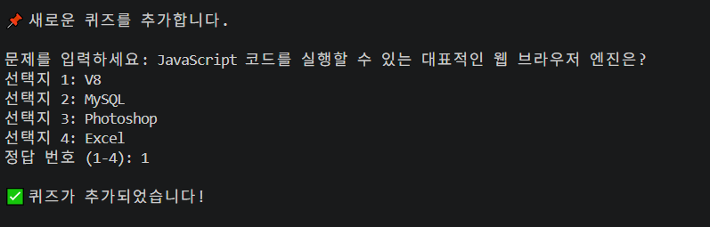

### 퀴즈 수정 (기존 값 유지 · 변경할 항목만 입력)

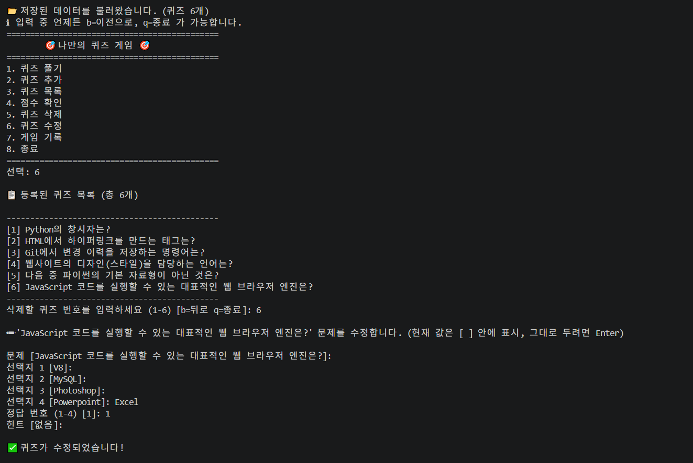

### 퀴즈 목록

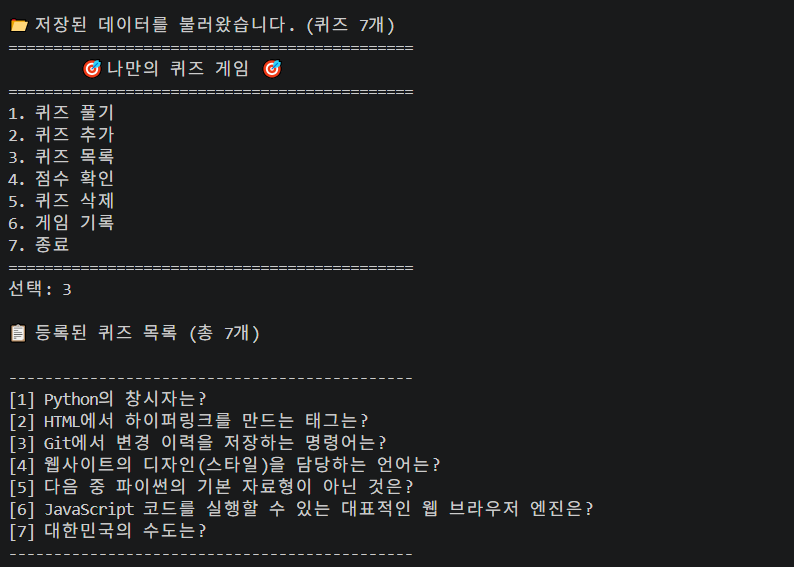

### 점수 확인 (총 플레이 횟수 포함)

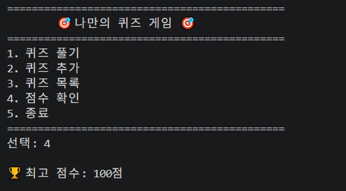

### 게임 기록 히스토리

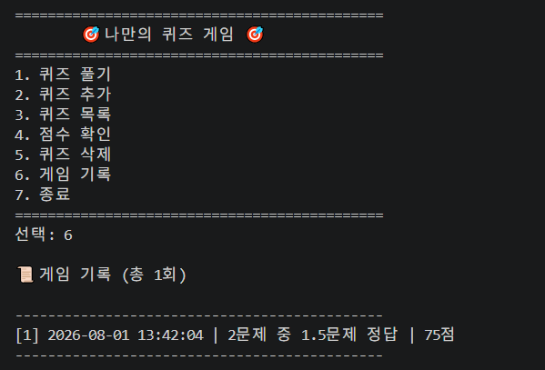

### 공통 입력 예외 처리 (빈 입력 / 숫자 변환 실패 / 범위 밖 입력)

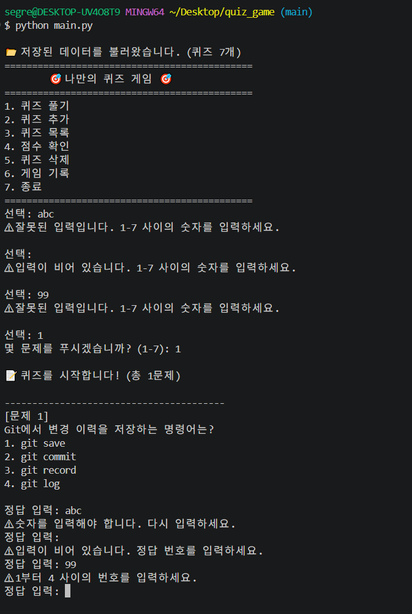

### Git 커밋 이력 (기능 단위 커밋, 브랜치 병합 포함)

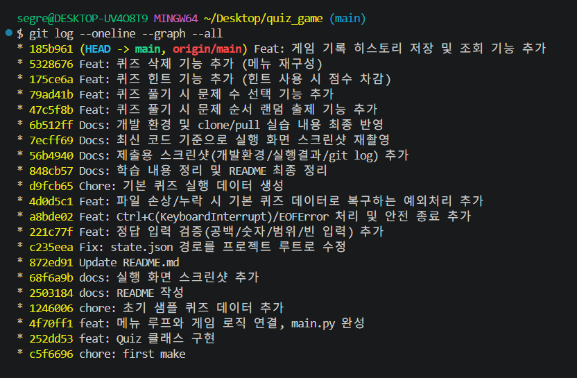

### Git 저장소 복제(clone) 및 pull 실습

별도 폴더에 저장소를 clone하여 README를 수정 후 push하고, 원래 작업 폴더에서
pull로 그 변경사항이 정상적으로 반영되는 것까지 확인한 전체 과정입니다.
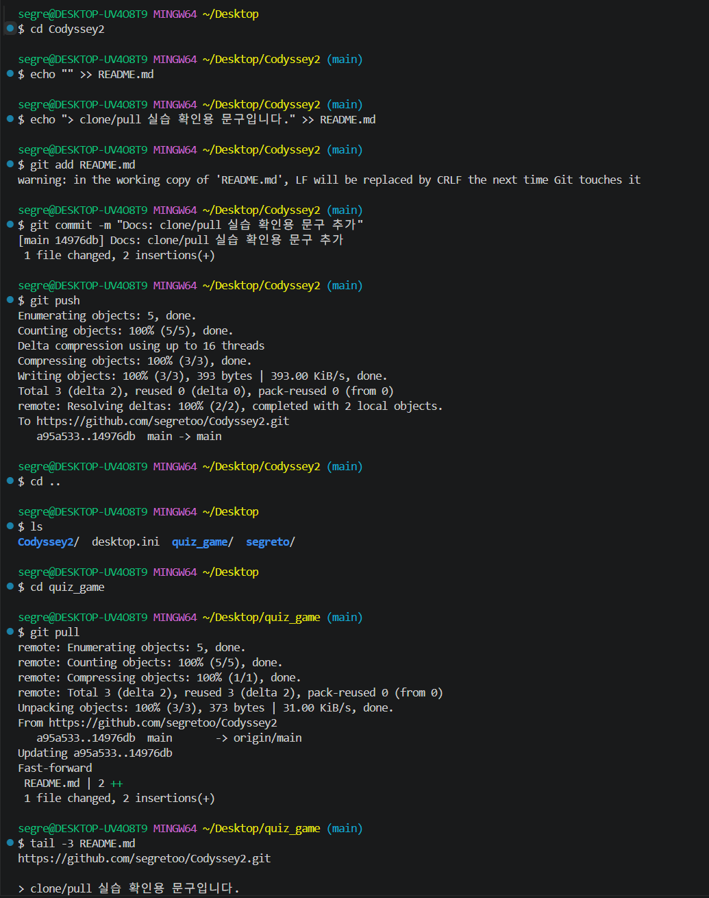

## 설계와 구현에 대한 노트

**입력 처리, 게임 진행, 데이터 저장을 나눈 기준**
"이 코드가 어떤 종류의 일을 하는가"를 기준으로 파일을 나눴습니다. 메뉴를
보여주고 사용자의 선택을 받는 부분은 실행 진입점에, 문제를 출제·채점하고
퀴즈를 추가·수정·삭제하는 게임 로직은 QuizGame에, 파일을 읽고 쓰는 부분은
별도 파일로 분리했습니다. 파일 저장 방식처럼 한 가지 관심사만 바뀌었을
때, 그와 무관한 다른 코드는 건드릴 필요가 없도록 하기 위해서입니다.

**저장 시점**
프로그램이 시작될 때 저장된 파일을 한 번 읽어와 메모리에 올려두고, 그
이후로는 메뉴에서 어떤 기능을 실행할 때마다 즉시 파일에 다시 저장합니다.
처음에는 종료할 때만 저장했는데, 종료 전에 강제로 꺼지면 그 사이의
변경사항이 사라지는 문제가 있어 매 동작 이후 저장하도록 바꿨습니다. 다만
데이터가 아주 많아진다면, 조작이 있을 때마다 파일 전체를 다시 쓰는 지금
방식은 비효율적일 수 있습니다. 퀴즈가 수천 개 이상으로 늘어나는 상황을
가정하면, 항목 하나를 바꿀 때마다 전체를 다시 쓰는 비용이 커지고 특정
퀴즈를 찾는 것도 목록을 처음부터 훑는 방식이라 느려질 수 있어, 그런
경우라면 SQLite 같은 경량 데이터베이스로 전환해 필요한 데이터만 조회하고
변경하는 편이 더 적합할 것입니다.

**예외 처리를 사용한 부분**
파일을 읽고 쓰는 과정은 항상 성공한다고 보장할 수 없어, 파일 내용이
손상되었거나 예상한 형식과 다르거나 쓰기 도중 문제가 생기는 경우를 예외
처리로 대비했습니다. 파일이 손상된 경우에는 안내 메시지를 보여주고 기본
퀴즈 데이터로 초기화하는데, 이는 이전 상태로 되돌리는 것이 아니라 처음
상태로 되돌리는 것이므로 그동안 추가했던 퀴즈나 기록은 복구되지 않습니다.
이를 보완하려면 저장할 때마다 별도의 백업 파일을 함께 남겨 손상 시 그
백업으로 복구를 시도하는 방식을 추가로 고려할 수 있습니다. 이와는 별개로
Ctrl+C나 입력 스트림 종료 상황도 예외 처리로 감지해, 프로그램이 그대로
죽지 않고 지금까지의 상태를 저장한 뒤 안전하게 종료되도록 했습니다.

**브랜치를 나눠 작업한 방식**
기본 브랜치는 항상 정상적으로 동작하는 상태로 유지하고 싶어, 기능을 만들
때마다 별도의 브랜치를 만들어 작업하고, 완성과 확인을 마친 뒤에 기본
브랜치로 합쳤습니다. 개발 중인 코드가 완성되기 전까지는 기본 브랜치에
영향을 주지 않기 위해서입니다.

**요구사항이 바뀐다면**
채점 방식(예: 점수 계산 공식)이 바뀐다면 게임 진행 로직의 점수 계산
부분만 수정하면 됩니다. 퀴즈 구조 자체(예: 선택지 개수, 정답 형식)가
바뀐다면 문제를 표현하는 부분과, 새 퀴즈를 입력받는 부분을 함께 수정해야
합니다. 역할을 파일과 클래스별로 나눠 두었기 때문에 어떤 요구사항이
바뀌든 무엇을 고쳐야 하는지가 비교적 명확하게 드러납니다.

## 학습 내용 정리

**Python 기초**
값에 이름을 붙여두는 변수, 숫자·문자열·참거짓·순서 있는 목록·이름으로
구분되는 값의 묶음이라는 서로 다른 자료형(int/str/bool/list/dict), 조건에
따라 다른 동작을 고르는 분기(if/elif/else), 정해진 횟수만큼 반복할 때와
조건을 만족할 때까지 반복할 때를 구분해 쓰는 반복문(for/while), 반복되는
동작을 이름 붙여 재사용하고 필요한 값을 주고받는 함수(매개변수와 반환값)를
프로그램 전반에 걸쳐 활용했습니다.

**클래스와 객체**
클래스는 어떤 대상이 가질 데이터와 행동을 미리 정의해 둔 설계도이고,
객체는 그 설계도를 바탕으로 실제로 만들어진 결과물입니다. 객체가 만들어질
때마다 자동으로 실행되는 특별한 메서드를 통해 초기값을 채워 넣고, 그
메서드 안에서 "지금 만들어지는 이 객체 자신"을 가리키는 참조를 이용해
객체마다 다른 데이터를 저장할 수 있게 했습니다. 이렇게 데이터(속성)와 그
데이터를 다루는 동작(메서드)을 하나로 묶어 관리했습니다.

**파일 입출력**
파일을 열어 내용을 읽거나 쓰고, 작업이 끝나면 자동으로 닫히도록 처리했습니다.
데이터는 JSON 형식으로 저장했는데, 사람이 읽기 쉽고 여러 프로그래밍 언어에서
공통으로 다룰 수 있으며 Python의 리스트/딕셔너리 구조와 거의 동일해 변환이
간단하기 때문입니다. 파일을 다루는 과정에서 생길 수 있는 오류는 예외 처리로
대비해, 문제가 생겨도 프로그램이 비정상적으로 종료되지 않도록 했습니다.

**Git 기초**

| 명령어     | 역할                                               |
| ---------- | -------------------------------------------------- |
| `init`     | 현재 폴더를 Git 저장소로 만듦                      |
| `add`      | 변경 내용을 다음 커밋에 포함할 준비                |
| `commit`   | 변경 내용을 하나의 이력으로 저장                   |
| `push`     | 로컬 커밋을 원격 저장소로 업로드                   |
| `pull`     | 원격 저장소의 변경사항을 가져와 합침               |
| `checkout` | 브랜치 이동(`-b`와 함께 쓰면 생성과 이동을 동시에) |
| `clone`    | 원격 저장소 전체를 새 로컬 디렉터리로 복제         |

브랜치는 기능 단위(`feature/이름`)로 만들어 작업한 뒤 기본 브랜치로
병합했고, clone/pull은 별도 폴더에 저장소를 복제해 README를 수정하고
push한 뒤, 원래 작업 폴더에서 pull로 그 변경사항이 정상적으로 반영되는
것까지 확인하는 방식으로 실습했습니다. (`docs/screenshots/pull.png` 참고)

## GitHub 저장소

https://github.com/segretoo/Codyssey2.git
